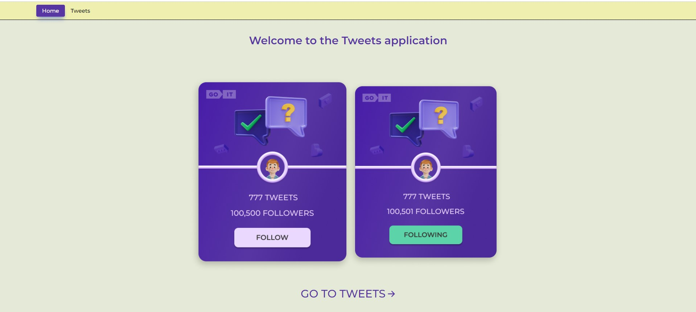

# YourTweets

YourTweets is a simple web application that allows a user to get a list of their
followers in the form of cards with information about them.

## How to use

To use the application, follow these steps:

1. Clone the repository to your computer:
   `git clone https://github.com/MarkoVoitovych/Tweets-test`
2. Navigate to the project directory: `cd YourTweets`
3. Install dependencies: `npm install`
4. Start the development server: `npm start`
5. Open your favorite browser and navigate to `http://localhost:3000.`

Or just open the project on the live page:
[YourTweets](https://delightful-concha-d367b2.netlify.app/)

## Technologies

The project is built with React and uses the Axios library to interact with the
[MockAPI](https://mockapi.io/) and [Firebase](https://firebase.google.com/)

## Author

Marko Voitovych
